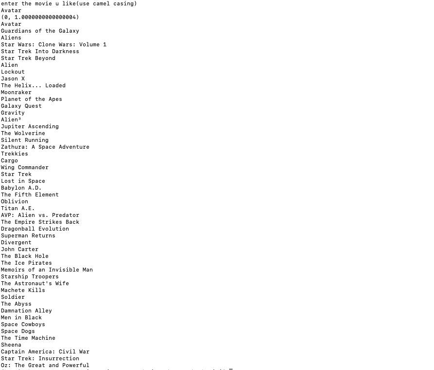

> Movie recommendation system 

it is a content based recommendation system ,using the features['keywords','cast','genres','director'] of each movie as a vector .
our recommendation system apply "cosine similarity" on these feature of every movie 
im

and outputs a list of movies with similar features

## Future work 
adding an extra feature based on rating so that it recommend movies accurately 
